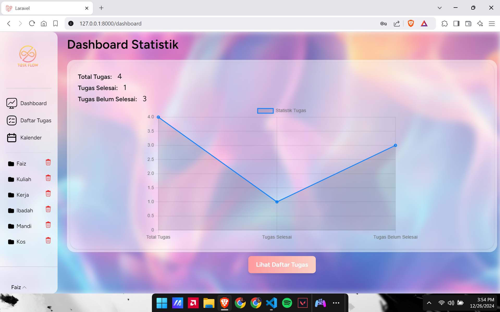
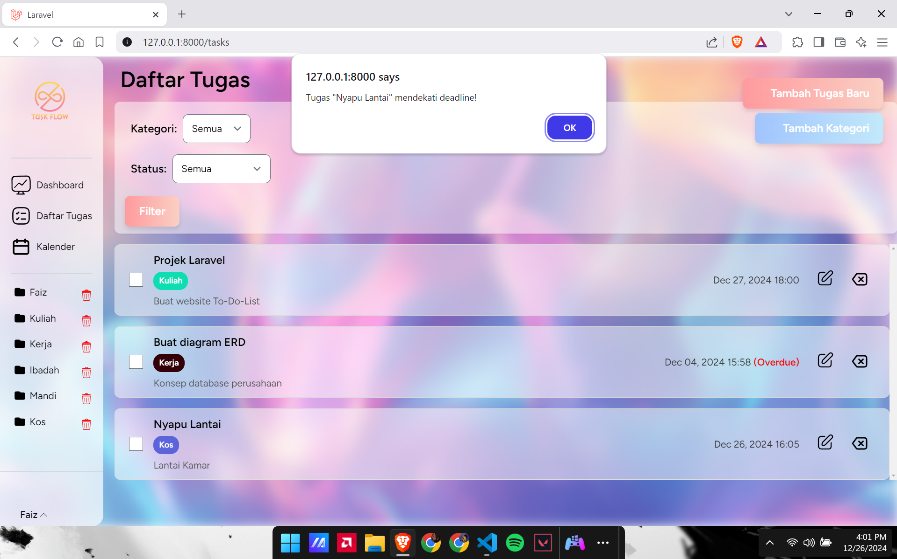
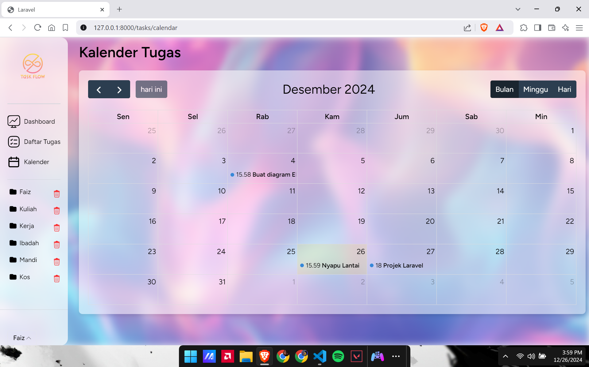

# 📊 Task-Flow

**Task-Flow** adalah aplikasi manajemen tugas yang dirancang untuk membantu pengguna mengatur dan menyelesaikan tugas dengan lebih efisien.

---

## 🚀 Fitur Utama

- 📊 **Dashboard Statistik Tugas**: Menampilkan Statistik tugas pengguna.
- ✅ **Manajemen Tugas**: Tambahkan, edit, dan hapus tugas jika diizinkan oleh peran pengguna.
- 📅 **Kalender Tugas**: Lihat tugas berdasarkan tanggal di tampilan kalender.
- 👤 **Manajemen Pengguna**: Sistem autentikasi pengguna yang aman.

---

## 🛠️ Instalasi

1. **Clone Repository**
   ```bash
   git clone https://github.com/Faizpi/Task-Flow.git
   cd Task-Flow
   ```

2. **Instal Dependensi**
   ```bash
   composer install
   npm install
   npm run build
   ```

3. **Konfigurasi Database**
   - Salin file `.env.example` menjadi `.env`
   - Sesuaikan konfigurasi database
   - Generate an Encryption Key:
     ```bash
     php artisan key:generate
     ```

4. **Migrasi Database**
   ```bash
   php artisan migrate
   ```

5. **Jalankan Aplikasi**
   ```bash
   php artisan serve
   ```

6. **Akses di Browser**
   - Buka [http://localhost:8000](http://localhost:8000)

---

## 💻 Teknologi yang Digunakan

- **Laravel** – Backend Framework
- **Blade** – Template Engine
- **MySQL** – Database
- **TailwindCSS** – Styling Framework

---

## 📸 Tangkapan Layar

**Halaman Dashboard:**


**Halaman Daftar Tugas:**


**Halaman Kalender Tugas:**


---

## 🤝 Kontribusi

1. Fork repository ini.
2. Buat branch baru: `git checkout -b fitur-baru`
3. Commit perubahan: `git commit -m 'Menambahkan fitur baru'`
4. Push branch: `git push origin fitur-baru`
5. Ajukan Pull Request

---

## 📄 Lisensi

Proyek ini dilisensikan di bawah **MIT License**. Lihat file [LICENSE](LICENSE) untuk detail lebih lanjut.

---

## 📬 Kontak

- **Nama:** Muhammad Faiz Bintang Pratama
- **Email:** faizbintang1244@gmail.com
- **GitHub:** [Faizpi](https://github.com/Faizpi)

---

🎯 **Task-Flow – Karena setiap tugas pantas mendapatkan perhatian!** 🚀


<p align="center"><a href="https://laravel.com" target="_blank"></a></p>

<p align="center">
<a href="https://github.com/laravel/framework/actions"></a>
<a href="https://packagist.org/packages/laravel/framework"></a>
<a href="https://packagist.org/packages/laravel/framework"></a>
<a href="https://packagist.org/packages/laravel/framework"></a>
</p>

## About Laravel

Laravel is a web application framework with expressive, elegant syntax. We believe development must be an enjoyable and creative experience to be truly fulfilling. Laravel takes the pain out of development by easing common tasks used in many web projects, such as:

- [Simple, fast routing engine](https://laravel.com/docs/routing).
- [Powerful dependency injection container](https://laravel.com/docs/container).
- Multiple back-ends for [session](https://laravel.com/docs/session) and [cache](https://laravel.com/docs/cache) storage.
- Expressive, intuitive [database ORM](https://laravel.com/docs/eloquent).
- Database agnostic [schema migrations](https://laravel.com/docs/migrations).
- [Robust background job processing](https://laravel.com/docs/queues).
- [Real-time event broadcasting](https://laravel.com/docs/broadcasting).

Laravel is accessible, powerful, and provides tools required for large, robust applications.

## Learning Laravel

Laravel has the most extensive and thorough [documentation](https://laravel.com/docs) and video tutorial library of all modern web application frameworks, making it a breeze to get started with the framework.

You may also try the [Laravel Bootcamp](https://bootcamp.laravel.com), where you will be guided through building a modern Laravel application from scratch.

If you don't feel like reading, [Laracasts](https://laracasts.com) can help. Laracasts contains thousands of video tutorials on a range of topics including Laravel, modern PHP, unit testing, and JavaScript. Boost your skills by digging into our comprehensive video library.

## Laravel Sponsors

We would like to extend our thanks to the following sponsors for funding Laravel development. If you are interested in becoming a sponsor, please visit the [Laravel Partners program](https://partners.laravel.com).

### Premium Partners

- **[Vehikl](https://vehikl.com/)**
- **[Tighten Co.](https://tighten.co)**
- **[WebReinvent](https://webreinvent.com/)**
- **[Kirschbaum Development Group](https://kirschbaumdevelopment.com)**
- **[64 Robots](https://64robots.com)**
- **[Curotec](https://www.curotec.com/services/technologies/laravel/)**
- **[Cyber-Duck](https://cyber-duck.co.uk)**
- **[DevSquad](https://devsquad.com/hire-laravel-developers)**
- **[Jump24](https://jump24.co.uk)**
- **[Redberry](https://redberry.international/laravel/)**
- **[Active Logic](https://activelogic.com)**
- **[byte5](https://byte5.de)**
- **[OP.GG](https://op.gg)**

## Contributing

Thank you for considering contributing to the Laravel framework! The contribution guide can be found in the [Laravel documentation](https://laravel.com/docs/contributions).

## Code of Conduct

In order to ensure that the Laravel community is welcoming to all, please review and abide by the [Code of Conduct](https://laravel.com/docs/contributions#code-of-conduct).

## Security Vulnerabilities

If you discover a security vulnerability within Laravel, please send an e-mail to Taylor Otwell via [taylor@laravel.com](mailto:taylor@laravel.com). All security vulnerabilities will be promptly addressed.

## License

The Laravel framework is open-sourced software licensed under the [MIT license](https://opensource.org/licenses/MIT).
